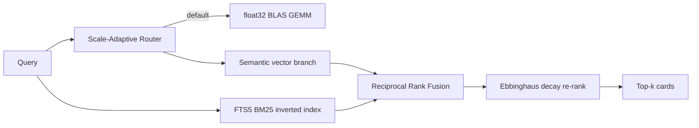

<div align="center">

# ⚛️ Isotope Zero

**Sub-millisecond, local-first cognitive memory layer for AI agents and LLM applications.**

[](#benchmark-scorecard)
[](#benchmark-scorecard)
[](https://www.python.org/downloads/)
[](LICENSE)
[](#tech-stack)

</div>

---

## 📖 Description

Isotope Zero is a high-performance, local-first memory layer designed to give AI agents long-term cognitive capabilities without the latency or cost of cloud-based vector databases. 

Unlike traditional RAG systems that rely on remote embedding APIs and multi-second round-trips, Isotope Zero operates entirely on the local host. It combines a WAL-backed float32 BLAS vector index, an Ebbinghaus decay model for temporal forgetting, and a hybrid FTS5+entity re-ranker. The result is an agent that remembers what mattered recently, forgets what didn't, and never pays a network bill to do either.

**Key Value Propositions:**
- **Ultra-Low Latency:** Sub-millisecond vector reads via local BLAS matrix multiplication.
- **Zero Inference Cost:** Quantized ONNX embeddings run locally in a shared daemon.
- **Cognitive Decay:** Built-in temporal forgetting ensures the agent's context stays fresh.
- **Knowledge Compaction:** Automatic consolidation of near-duplicate memories to shrink active context.

---

## 🛠 Tech Stack

Isotope Zero is engineered for minimal footprint and maximum throughput:

- **Core Logic:** Python 3.10+
- **Vector Acceleration:** NumPy (float32 BLAS GEMM)
- **Storage Engine:** SQLite (WAL mode, FTS5 for lexical search)
- **Embedding Runtime:** ONNX Runtime (Local quantized models)
- **Distribution Wrapper:** Node.js (for `izero-cli` npm distribution)
- **Framework Support:** First-class adapters for LangChain, LlamaIndex, AutoGen, and CrewAI.

---

## 🚀 Installation

### Via npm (Recommended for CLI)
The npm wrapper provisions a private Python environment and installs the `izero-cli` automatically.

```bash
npm install -g izero-cli
# Or run without installation
npx izero-cli --help
```

### Via Python (For Developers)
```bash
git clone https://github.com/isotope-zero/isotope-zero.git
cd isotope_zero
pip install -e ".[dev]"
```

### Via Universal Installer
```bash
curl -fsSL https://raw.githubusercontent.com/isotope-zero/isotope-zero/main/tools/izero_cli/install.sh | sh
```

---

## 🕹 Usage

### Interactive Command Center
Running the bare `izero` command opens an interactive onboarding menu. It provides a welcome banner and an easy-to-navigate list of actions.

```bash
izero
```

### Direct CLI
For scripting and power users, use direct subcommands:
- `izero add "Fact text" --tags tag1,tag2`
- `izero recall "Query text" --top-k 5`
- `izero stats <db_path>`
- `izero search <db_path> "Query"`

### Python SDK
```python
from isotope_zero.client import IsotopeZero

# Initialize (use_mmap=False is recommended for production)
mem = IsotopeZero(db_path="mem.db", use_mmap=False)

# Remember a fact
mem.remember(
    fact="The user prefers Rust over Go",
    tags=["preference", "language"],
    importance=0.8
)

# Recall related memories
hits = mem.recall("which language does the user prefer?", k=3)
for h in hits:
    print(f"{h['score']:.3f}  {h['fact']}")

mem.close()
```

---

## ⌨️ Controls

### Interactive Menu
- **Arrow Keys ($\uparrow \downarrow$):** Navigate through command options.
- **Enter:** Select and execute the highlighted command.

### CLI Flags
- `--json`: Returns stable machine-readable JSON output (ideal for SDKs/MCP).
- `--verbose`: Displays detailed technical columns (ID, score, age, vitality).
- `--top-k N`: Limits the number of returned results.

---

## 📈 Deep Dive & Benchmarks

### Why Isotope Zero?
Most agent-memory systems trade tokens and latency for flexibility. Isotope Zero flips the priority: **cost and latency first, semantics on top**.

| Dimension | Isotope Zero (measured) | Mem0 (audit) | Pinecone (vendor) |
|---|---|---|---|
| **Cold start** | **< 50 ms ready-to-serve** | 2–5 s | — (hosted) |
| **Vector read p99 @ 10k** | **0.284 ms** | 50–200 ms | ~1–10 ms |
| **Process RSS** | **~28 MB client** | 200 MB–2 GB | — (out-of-process) |
| **Network calls** | **0** | Every add/search | Every add/search |
| **Inference cost** | **$0** (local ONNX) | API bill | API bill |

### Architecture
Isotope Zero utilizes a **Scale-Adaptive Router** that blends float32 BLAS GEMM for speed, FTS5 BM25 for lexical precision, and an Ebbinghaus decay re-ranker to simulate human-like memory retention.



---

## 🔌 Framework Adapters

Isotope Zero provides drop-in providers for the major AI agent frameworks.

| Framework | Import | Key Capability |
|---|---|---|
| **LangChain** | `IsotopeZeroVectorStore` | `similarity_search_with_score` |
| **LlamaIndex** | `IsotopeZeroVectorStore` | `query(similarity_top_k=)` |
| **AutoGen** | `IsotopeZeroMemory` | `attach_to_agent` (isolated by `agent_id`) |
| **CrewAI** | `IsotopeZeroMemory` | `recall_for_agent` (cross-agent recall) |

---

## 📚 Documentation

- [`docs/architecture.md`](docs/architecture.md) - Research evolution and structural RSS analysis.
- [`docs/adapters.md`](docs/adapters.md) - Detailed framework provider reference.
- [`docs/cli.md`](docs/cli.md) - Full `izero` CLI command reference.

---

## 📄 License

[MIT](LICENSE). © 2026 Svanik Kolli.
