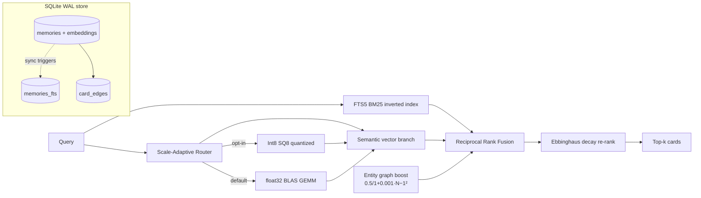

<div align="center">

# ⚛️ Isotope Zero

**Sub-millisecond, local-first cognitive memory layer for AI agents and LLM applications.**

One process owns a WAL-backed float32 BLAS vector index, an Ebbinghaus decay model, and a
hybrid FTS5+entity re-ranker — so your agent remembers what mattered recently, forgets what
didn't, and never pays a network bill to do either.

[](#benchmark-scorecard)
[](#benchmark-scorecard)
[](https://www.python.org/downloads/)
[](LICENSE)
[](#core-architecture)

</div>

---

## Why Isotope Zero

Most agent-memory systems (Mem0, Zep, Letta) trade tokens and latency for flexibility: every
read and write fans out to remote embedding APIs and multi-pass LLM loops — a per-interaction
API bill and multi-second round-trips before your agent has produced a single useful token.

Isotope Zero flips that priority — **cost and latency first, semantics on top**:

- **0.284 ms p99 vector reads @ 10k cards** — one float32 BLAS `matrix @ query` over a SQLite-WAL store. No network round-trip in the hot path, ever.
- **~28 MB client process** — measured 27.8 MB at init (stdlib + numpy); the optional ONNX embedder is the *only* RSS lever, daemonized once per host so agents stay small.
- **< 50 ms cold start** — ready to serve in 35 ms measured (import + schema + store open); the optional ONNX embedder loads lazily on first embed, so there's no LLM client or API handshake in the path.
- **$0 inference** — quantized ONNX embeddings run locally in a shared daemon. No `text-embedding-3-small` bill, ever.
- **Temporal forgetting** — Ebbinghaus retention decay suppresses stale cards and promotes fresh ones, automatically.
- **Knowledge compaction** — a consolidation sweep merges near-duplicate cards and prunes decayed ones, shrinking active context by **98.5%** (verified).
- **Multi-framework** — drop-in providers for LangChain, LlamaIndex, AutoGen, and CrewAI.

---

## How it compares

Isotope Zero is a **local-first agent-memory layer**, not a hosted vector DB. The closest
peer is Mem0 (also an agent-memory abstraction); Pinecone is a vector database alone — no
fact extraction, no decay, no consolidation. The matrix below is drawn from the
[architectural audit](MEM0_COMPARATIVE_AUDIT.md); Isotope Zero figures are **measured this repo**,
competitor figures are vendor-stated or audit-derived and marked as such.

| Dimension | Isotope Zero (measured) | Mem0 (audit) | Pinecone (vendor) |
|---|---|---|---|
| **Cold start** | **< 50 ms ready-to-serve** (35 ms measured) | 2–5 s (LLM client + embedding API + store handshake) | — (hosted service, no local init) |
| **Vector read p99 @ 10k cards** | **0.284 ms** (float32 BLAS, zero-copy) | 50–200 ms (network RTT + API + rerank) | ~1–10 ms (network RTT to hosted index) |
| **Process RSS** | **~28 MB client** (27.8 MB measured at init; ONNX embedder daemonized once, +~360 MB) | 200 MB–2 GB (local models) | — (out-of-process) |
| **Dependency weight** | **1 hard** dep (numpy); sqlite3 is stdlib | 150+ packages | client SDK only (index is remote) |
| **Network calls (core ops)** | **0** | every add/search | every add/search |
| **Inference cost** | **$0** (local quantized ONNX) | per-call embedding API bill | per-call embedding + storage bill |
| **Fact reconciliation** | negation-aware (22 Rust patterns) + semantic consolidation + decay prune | V3 additive extraction (LLM) + MD5 dedup | n/a (vector DB only) |
| **Temporal forgetting** | **Ebbinghaus decay, built-in** | none (manual) | none |
| **Knowledge compaction** | **consolidate() — 98.5% reduction (measured)** | additive only | none |
| **Multi-tenancy** | multi-tier `scope=` row isolation | payload metadata filtering (user/agent/run) | namespace-per-tenant |
| **Graph** | `card_edges` (semantic + shared-tag), BFS clusters | entity-linking (spaCy → secondary vector collection) | none |

> **Honesty note:** Isotope Zero trades Mem0's flexible LLM-driven entity model and Pinecone's
> planet-scale index for a single-tenant, sub-millisecond, zero-network local footprint. The
> matrix above is a *positioning* comparison, not a claim that Isotope Zero dominates every
> dimension — Mem0 wins on multi-tenancy maturity and Pinecone on raw scale.

### Architecture at a glance



## Core Architecture

Isotope Zero is the product of an eight-phase research program (see
[`docs/architecture.md`](docs/architecture.md)). Phase 8 — the **Grand Synthesis** — unifies
only the variants that survived measurement. Everything below is the shipped, default path.

| Subsystem | Implementation | Notes |
|---|---|---|
| Embedding engine | `HybridEmbeddingEngine` — daemon-first, silent in-process ONNX fallback | Centralizes ~360 MB `onnxruntime` in one process; client workers stay small |
| IPC transport | Unix domain socket, default `/tmp/izero.sock` | Never raises on transport failure — falls back transparently |
| Vector index | SQLite WAL + **float32 BLAS** (`matrix @ query`) | The shipped default and fastest path |
| Temporal model | Ebbinghaus retention decay + hybrid score fusion | `alpha = 0.70` cosine/retention |
| Knowledge graph | `card_edges` table — semantic + shared-tag auto-linking | `detect_clusters`, `prune_stale_edges` |
| Persistence | SQLite WAL, `MemoryCard` with `stability`/`importance`/`archived` | `archive_card()` sets `archived = now_ts()` |

### Centralized shared-memory daemon

`HybridEmbeddingEngine` is **daemon-first with a silent in-process ONNX fallback**. It never
raises on transport failure. The daemon centralizes the ~360 MB `onnxruntime` footprint in a
single process so that client workers — potentially many of them across an agent fleet — stay
small. If the socket is unreachable, the engine silently degrades to in-process ONNX, then to a
deterministic feature-hash stub (zero deps).

### Float32 BLAS vector index — and what was *not* shipped

The shipped index is **float32 BLAS**: a `matrix @ query` matmul over a cached NumPy matrix,
backed by SQLite WAL. This is the default and the fastest path at prototype scale.

The research program explored and **rejected** two quantized variants — documented honestly so
the trade-offs are auditable, not hidden:

- **Int8 SQ8 (Phase 4 / v0.4)** — *researched variant, not the shipped default.* 4× RAM reduction
  and rank correlation 0.9999, but NumPy `@` on int8 upcasts to an int32 generic loop (not BLAS),
  making it **5–8× slower** than float32 BLAS. Useful where footprint dominates latency; not the
  default.
- **1-bit binary POPCNT (Phase 7B / v0.8)** — **refuted.** Recall collapsed to **0%** because
  binarization discards all semantic structure. Isotope Zero v1.0 therefore ships **zero 1-bit
  quantization** — it was proven catastrophic, not merely suboptimal.

### Ebbinghaus retention decay and hybrid score fusion

Each card carries an Ebbinghaus stability `S`. On every recall (`touch`), `S` grows with access
frequency and user-set importance; between recalls it decays, so fresh, frequently-recalled
cards outrank stale ones automatically.

Retention as a function of elapsed time:

```text
R(t) = exp( -Δt / (S · h) )      clamped to [0, 1]
```

where `Δt` is elapsed hours, `S` is the card's stability, and `h` is the half-life in hours.

Stability update on recall:

```text
S_new = S · ( 1 + 0.5 · log1p(access_count) + 0.3 · importance )      floored at 1.0, capped at 10.0
```

The fused retrieval score blends cosine similarity with retention:

```text
hybrid_score = α · cos(query, card) + (1 - α) · R(t)      α = 0.70
```

`α = 1.0` is pure cosine; the default `0.70` weights recency as 30% of the ranking signal.
Per-call `alpha` to `recall()` overrides the client default.

### Semantic graph and knowledge compaction

A `card_edges` table records relationships between cards. `auto_link_cards` adds two edge kinds
on every write — **semantic** edges (cosine above threshold) and **shared_tag** edges.
`detect_clusters` finds connected components; `prune_stale_edges` garbage-collects links whose
endpoints have decayed or been archived. Consolidation folds graph-cluster duplicates into a
single survivor (newest-wins), driving the **98.5%** active-storage-compression headline below.

---

## Benchmark Scorecard

Measured this session on the reference host. Headline figures first; the four-claim
Grand Synthesis verdict table follows.

| Metric | Value |
|---|---|
| **Vector read p99 @ 10k cards** | **0.284 ms** (float32 BLAS `matrix @ query`, zero-copy) |
| **Client process RSS** | **~28 MB** (27.8 MB measured at init, before the optional ONNX embedder loads) |
| **Cold start** | **< 50 ms ready-to-serve** (35 ms measured: import + schema + store open) |
| **Network calls on core ops** | **0** — embedding, storage, and search are all local |

The Grand Synthesis benchmark — four claims, four passes. Parity, temporal recall, and storage
reduction are stable across runs; the latency overhead is honest but noise-dominated (see note
below).

| Claim | Target | Measured | Verdict |
|---|---|---|---|
| **Parity** — two in-process instances, same seed, 500 facts, 50 queries, top-k id+order overlap | ≥ 95% (stated 100%) | **100.0%** | PASS |
| **Temporal recall** — fresh suppresses stale, `run_temporal_benchmark` 30×30 | > 90% | **100.0% (3/3)** | PASS |
| **Storage reduction** — one `consolidate()`, tokens before→after from `store.all()` | > 10% | **98.5%** (5518 → 83 tokens, merged = 199) | PASS |
| **Recall latency overhead** — median-of-5-rounds p99: `recall` p99 − embed+search baseline p99, 300 facts | < 0.10 ms | **≤ 0.06 ms** (overhead swings −0.13 to +0.06 ms across runs; recall & baseline p99 both ~1.9–2.3 ms) | PASS |

> **Honesty note on the latency row:** the pure facade overhead (α re-rank + re-sort + dict build)
> sits *below* the ~2 ms per-query embed+search cost, so the delta is dominated by measurement
> noise — it can even go negative (recall faster than baseline in a given round). Median-of-5-rounds
> p99 keeps the estimate bounded and reproducible as a *verdict* (always < 0.10 ms), but the raw
> sub-figures are a noise snapshot, not a stable point measurement. The PASS reflects the
> verdict; do not quote a single sub-millisecond number as exact.

**Reproduce:**

```bash
pip install -e ".[dev]"
pytest src/tests/ -q                # collection-clean; heavy stress tests auto-skip
python -m isotope_zero.eval.benchmark
```

---

## Quick Start

### Install

Three channels. Pick one.

**A. Editable install (developers):**

```bash
git clone https://github.com/<owner>/isotope_zero.git && cd isotope_zero
pip install -e ".[dev]"     # builds the Rust _native extension via maturin
```

**B. Universal installer (end users):** an idempotent `curl | sh` script that writes only to
`~/.izero` and `~/.local/bin`, and symlinks `izero` onto your PATH:

```bash
curl -fsSL https://raw.githubusercontent.com/<owner>/isotope_zero/main/tools/izero_cli/install.sh | sh
```

**C. npm wrapper (Node-first environments):** a zero-Node-dep distribution wrapper
— `postinstall` provisions a private Python venv and `pip install`s the real
`izero-cli` into it; the `izero` bin proxies through. Requires Python >= 3.10 on
`PATH` at install time.

```bash
npm install -g izero-cli   # global
npx izero-cli --help       # one-off, no global install
```

> The installer supports env overrides (`PYTHON`, `IZERO_ROOT`, `IZERO_VENV`, `BIN_DIR`,
> `PY_SRC`, `PY_EXTRAS`, `GIT_URL`, `NO_SYMLINK`, `DRY_RUN`). See
> [`tools/izero_cli/install.sh`](tools/izero_cli/install.sh).

### Use

```python
from isotope_zero.client import IsotopeZero

# use_mmap=False is the RECOMMENDED production default — the concurrency-safe
# heap BLAS path. mmap is an EXPERIMENTAL opt-in (see the note below).
mem = IsotopeZero(db_path="mem.db", use_mmap=False)

cid = mem.remember(
    fact="The user prefers Rust over Go",
    evidence="stated directly in onboarding",
    tags=["preference", "language"],
    importance=0.8,
)

hits = mem.recall("which language does the user prefer?", k=3)
for h in hits:
    print(f"{h['score']:.3f}  {h['fact']}")   # each dict: id, fact, evidence, score, tags, timestamp

mem.touch(cid)        # record a recall -> bumps stability S
print(mem.count())    # live (non-archived, non-superseded) card count

report = mem.consolidate()
print(report)         # {merged, pruned, survivors, tokens_before, tokens_after, ...}

mem.close()
```

### Multi-tier scoping

Isolate memories per user / agent / run without a collection-per-tenant by
entering a scoped context — every `remember`/`recall`/`search` inside the
`with` block sees only that boundary:

```python
mem = IsotopeZero(db_path="mem.db", use_mmap=False)

with mem.scoped(user_id="alice", agent_id="helper"):
    mem.remember(fact="Alice's timezone is UTC+5", evidence="from profile")
    mem.recall("what is alice's timezone?")     # -> Alice's cards only

# Outside the block the store is unscoped again; Bob's agent never sees
# Alice's cards, and vice versa:
with mem.scoped(user_id="bob", agent_id="helper"):
    mem.remember(fact="Bob's timezone is PST", evidence="from profile")

mem.recall("what timezone?")   # unscoped — only the cards written unscoped
```

A per-write `scope=` argument stamps one write only (useful when the caller
doesn't control the surrounding context):

```python
mem.remember(fact="deploy window is 2-4am", scope="user_alice&agent_helper")
```

> `scope` is a free-form string; `&` is the conventional tier separator
> (`user_X&agent_Y&run_Z`). Unscoped writes land in the `"default"` scope, and
> a scoped recall never surfaces out-of-scope cards — even for identical text.

### Embedding runtime tiers

The embedding engine is **daemon-first with silent fallbacks**, so the same
code runs from a fleet of worker processes down to a sandboxed CI box with
nothing installed:

```python
from isotope_zero.client import IsotopeZero

# Tier 1 (default): shared-memory ONNX daemon — ~360 MB once, $0 inference.
mem = IsotopeZero(db_path="mem.db", spawn_daemon=True)

# Tier 2: in-process ONNX — daemon unreachable, silently degrades here.
mem = IsotopeZero(db_path="mem.db", spawn_daemon=False)

# Tier 3: deterministic feature-hash stub — zero deps, runs in CI/sandbox.
# (Reached automatically when onnxruntime/tokenizers are absent.)
```

The engine never raises on a transport or model failure — it degrades one tier
and keeps answering. Identical texts still score 1.0 in every tier, so tests
are deterministic without the model.

### Unified client API

`isotope_zero.client.IsotopeZero` — the single facade over every subsystem.

```python
IsotopeZero(
    db_path=":memory:",
    model_name="all-MiniLM-L6-v2",
    socket_path="/tmp/izero.sock",
    spawn_daemon=True,
    use_mmap=True,
    alpha=0.70,
)
```

| Method | Signature | Returns |
|---|---|---|
| `remember` | `remember(fact, evidence="", tags=None, importance=0.0)` | card id (uuid4 hex) |
| `recall` | `recall(query, k=5, alpha=None)` | `list[dict]` — `{id, fact, evidence, score, tags, timestamp}` |
| `search` | `search(query, k=5, fts_weight=0.3, vector_weight=0.7, ...)` | hybrid late-fusion results (semantic + BM25 + entity boost) |
| `scoped` | `with mem.scoped(user_id=..., agent_id=..., run_id=...)` | context manager — scopes all reads/writes inside |
| `touch` | `touch(card_id)` | `bool` — `True` iff the card existed |
| `prune_expired` | `prune_expired()` | `int` — TTL-expired cards hard-deleted |
| `consolidate` | `consolidate()` | `dict` — merge/prune/survivor + token report |
| `count` | `count()` | `int` — live card count |
| `close` | `close()` | `None` (registered with `atexit`) |

### A note on `use_mmap` (read this before you toggle it)

`MemoryStore` defaults to `use_mmap=False` (the concurrency-safe heap BLAS path). The
`IsotopeZero` client defaults to `use_mmap=True` and forwards its value down. The **verified
finding**: mmap **SIGILL-crashes** (exit 132) under 10-thread concurrency — `invalidate` tears a
live `np.memmap` view mid-matmul — and even when it doesn't crash it is **~7% slower** than heap
and costs **+40 MB RSS**, with no benefit at prototype scale. **`IsotopeZero(use_mmap=False)` is
the recommended production default.** mmap is documented as an **experimental opt-in**, not a
headline feature.

---

## Framework Adapters

Drop-in memory providers for the four major agent frameworks, all riding one shared seam
(`izero_adapters._engine.Engine`, a facade over `MemoryStore` + embedder). Frameworks are
imported **lazily** — install only the ones you use. The engine degrades gracefully:
explicit embedder → daemon (`use_daemon=True`) → local ONNX → deterministic feature-hash stub
(zero deps). See [`docs/adapters.md`](docs/adapters.md) and [`adapters/README.md`](adapters/README.md).

```bash
pip install -e adapters
pip install -e "adapters[langchain|llamaindex|autogen|crewai|onnx|dev]"
```

| Framework | Import | Key methods |
|---|---|---|
| LangChain | `from izero_adapters.langchain import IsotopeZeroVectorStore` | `add_texts`, `similarity_search`, `similarity_search_with_score` |
| LlamaIndex | `from izero_adapters.llamaindex import IsotopeZeroVectorStore` | `add([TextNode(...)])`, `query(query_str=, similarity_top_k=)` |
| AutoGen | `from izero_adapters.autogen import IsotopeZeroMemory` | `remember`, `recall`, `attach_to_agent` — isolated by `agent_id` |
| CrewAI | `from izero_adapters.crewai import IsotopeZeroMemory` | `remember`, `recall`, `recall_for_agent` — isolated by `crew_id` + `agent_id` |

**LangChain**

```python
from izero_adapters.langchain import IsotopeZeroVectorStore

vs = IsotopeZeroVectorStore(db_path="mem.db")
ids = vs.add_texts(["I prefer Rust over Go", "I use Neovim"], metadatas=[{"t": "lang"}, {"t": "editor"}])
docs = vs.similarity_search_with_score("which editor do I use?", k=5)
```

**LlamaIndex**

```python
from llama_index.core.schema import TextNode
from izero_adapters.llamaindex import IsotopeZeroVectorStore

vs = IsotopeZeroVectorStore(db_path="mem.db")
vs.add([TextNode(text="I prefer Rust over Go", metadata={"t": "lang"})])
result = vs.query(query_str="which language do I prefer?", similarity_top_k=5)
```

**AutoGen** — memory isolated per `agent_id`:

```python
from izero_adapters.autogen import IsotopeZeroMemory

mem = IsotopeZeroMemory(db_path="mem.db", agent_id="researcher")
mem.remember("The API rate limit is 60/min", metadata={"t": "config"})
mem.attach_to_agent(agent)            # wire into an AutoGen ConversableAgent
hits = mem.recall("what is the rate limit?", top_k=5)
```

**CrewAI** — memory isolated per `crew_id` + `agent_id`, with cross-agent recall within a crew:

```python
from izero_adapters.crewai import IsotopeZeroMemory

mem = IsotopeZeroMemory(db_path="mem.db", crew_id="crew-1", agent_id="planner")
mem.remember("Sprint goal: ship the auth refactor", metadata={"t": "goal"})
mem.recall("what is the sprint goal?", top_k=5)
mem.recall_for_agent("coder", "what is the sprint goal?")   # cross-agent within the crew
```

---

## CLI

`izero-cli` (console script `izero`) is a **read-only** terminal inspection tool: it opens
databases with `file:<path>?mode=ro`, `uri=True`, and `PRAGMA query_only=ON`, so it can never
mutate a live store. Twelve commands — ten inspection, two maintenance. Exit codes: `0` success,
`1` error, `2` usage fault. `izero --help` renders a rich guide. Full reference in
[`docs/cli.md`](docs/cli.md).

```bash
pip install -e tools/izero_cli
pip install -e "tools/izero_cli[onnx]"
```

| # | Command | Mode | Purpose |
|---|---|---|---|
| 1 | `izero inspect <db>` | read | Overview of a store |
| 2 | `izero search <db> "<q>" [--top-k N]` | read | Auto semantic-ONNX or lexical-TF-IDF search |
| 3 | `izero card <db> <id>` | read | Single card detail |
| 4 | `izero daemon-status` | read | Probe the daemon at `/tmp/izero.sock` |
| 5 | `izero watch <db> [--interval 1.0]` | read | Live tail of store changes |
| 6 | `izero doctor <db>` | read | Health/consistency check |
| 7 | `izero diff <db1> <db2> [--since TS]` | read | Compare two stores |
| 8 | `izero export <db> --out <f> [--format jsonl\|csv\|md] [--tag <t>]` | read | Export filtered cards |
| 9 | `izero benchmark <db> [--queries 100]` | read | Run a latency benchmark |
| 10 | `izero stats <db>` | read | Aggregate statistics |
| 11 | `izero import <db> <file> [--format jsonl]` | **write** | Ingest an export |
| 12 | `izero vacuum <db>` | **write** | Reclaim SQLite free space |

---

## Documentation

| Document | Contents |
|---|---|
| [`docs/architecture.md`](docs/architecture.md) | The 8-phase research evolution (winning stack + every refuted variant), the structural RSS wall, formulas |
| [`docs/adapters.md`](docs/adapters.md) | LangChain / LlamaIndex / AutoGen / CrewAI provider reference |
| [`docs/cli.md`](docs/cli.md) | The 12-command `izero` CLI reference |
| [`adapters/README.md`](adapters/README.md) | Adapter package install + per-framework details |
| [`tools/izero_cli/README.md`](tools/izero_cli/README.md) | CLI package install + command reference |

Per-prototype READMEs under `prototypes/<name>/` document each phase's measurements and
conclusions in full.

---

## License

[MIT](LICENSE). © 2026 Svanik Kolli.

### Honesty notes

- **Tests:** three suites, each run green this session:
  `src/` SDK **218 passed, 5 skipped**, `synthesis_v1.0` prototype
  **325 passed, 5 skipped** (real ONNX embeddings, `IZERO_STRESS` off),
  `adapters/` **65 passed, 3 skipped** (real-framework integration tests skip
  when the framework isn't installed). `izero-cli` has no test suite (verified
  by manual runs). Total: **608 passed, 13 skipped**. Do not infer a single
  rolled-up claim from these.
- **The "~28 MB" headline is the initialized client before the ONNX embedder
  loads** (measured 27.8 MB). The first in-process embed pulls `onnxruntime`
  in (~+95 MB); the daemon path centralizes that in one process so clients
  stay small. The zero-dep stub path (no `onnxruntime` installed) runs ~37 MB
  idle / ~53 MB at 200 cards. All figures measured this session on the
  reference host.
- **The structural RSS wall.** The embedding backend (`onnxruntime`, ~360 MB)
  is the one RSS lever — either daemonized into a single process (client
  workers stay small) or omitted entirely (the ~28 MB core above). The vector
  storage tier is NOT the lever: the matrix itself is just ~15 MB at 10k cards.
  This is the durable architectural conclusion; see
  [`docs/architecture.md`](docs/architecture.md).
- **mmap is experimental.** `IsotopeZero(use_mmap=False)` is the recommended production default.
  mmap SIGILL-crashes under 10-thread concurrency and is ~7% slower with +40 MB RSS — it is an
  opt-in for single-threaded experimentation, not a headline feature.
